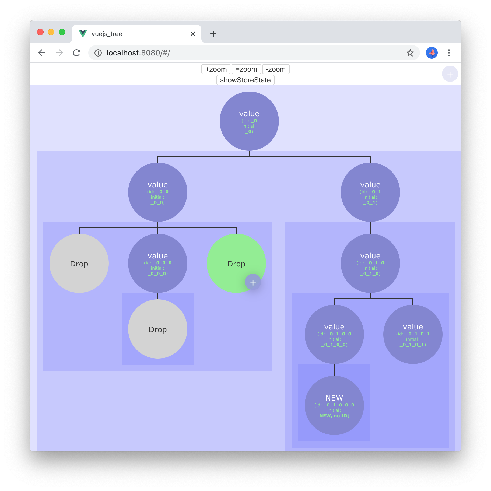

# vuejs_tree
A tree graph made using Vue.js and html+css.



## Requirements
- Requirements
	- ([Node.js](https://nodejs.org/))
	- npm (Should come with node)
- Used Vue CLI version: [4.2.2](https://github.com/vuejs/vue-cli/releases/tag/v4.2.2) .

## Intro
This is a small project which shows a part of a larger project. The idea is to create an example of how to create a graphical tree structure using [Vue.js](https://vuejs.org/).

This project uses:
- [Vue.js](https://vuejs.org/)
- [Vue CLI](https://cli.vuejs.org/)
- [Vuex](https://vuex.vuejs.org/)
- [Vue Router](https://router.vuejs.org/) (it could be ommited in this project)

## Functionalities
This is what this project does:
- Creates a graphical tree structure (graph) based on a JSON structure managed in the *store* (Vuex).
- Allows zoom (with buttons).
- Shows current store (toggle with a button).
- Some drag and drop stuff is implemented but it isn't working yet.

## To do
This are some functionalities that would be nice and maybe will be done in the future:
- Allow nodes movement. Using drag and drop it would be nice to be able to move nodes from one location to another, that is change their parent and change where they appear under a parent.  
<span style="font-size:0.8em;">This would work using draggable but the actual movement would be implemented in Vuex (the store) to allow Vue to recreate the tree with the changed structure.</span>
- Add a small box showing the full tree with a box showing the current view.
- Add lines to join the bottom of the parent node to the top of a node.

## Using CSS for the tree
I've tested two ways of implementing the tree using only CSS: using [`flexbox`](https://www.w3schools.com/css/css3_flexbox.asp) and using [`inline-block`](https://www.w3schools.com/Css/css_inline-block.asp).

*Note: I also thought about using [`CSS grid`](https://www.w3schools.com/css/css_grid.asp) but that requires knowing the column count and changing CSS accordingly which would complicate things.*

### Using `Flexbox`
This is how the tree is constructed using `Flexbox`.

```css
/* Only relevant parts displayed */

.nodeRow {
	overflow: auto;
	display: flex;
	flex-direction: row;
	flex-wrap: nowrap;
	justify-content: stretch;
	align-items: flex-start;
}
```

Pro:
- The structure is rigid.

Con:
- When the content is not bigger than the container it's taken to the left (not centered).
- Using `justify-content: center;` does work when the zoom is far but when the zoom is at initial state and the content is larger than the container it gets cut off (This happens in Chrome version 80).

Here's an idea to avoid the cons but I haven't tried it:
> When zooming there could be a JavaScript computation to see if the tree is smaller than its container, in that case use `justify-content: center;`. The calculation would take the first `.nodeRow` children and would sum their full width (withh padding, outline, margin, etc.) and if their sum is smaller use `justify-content: center;`; if it's not use `justify-content: strech;`.

### Using `inline-block`
This is how the tree is constructed using `inline-block`.
```css
/* Only relevant parts displayed */

.nodeRow {
	white-space: nowrap; /* Whithout this the tree is unordered when there is not enough space. */
	overflow: auto;
}

.node {
	display: inline-block;
	vertical-align: top;
}
```

Possible con:
- Maybe with `inline-block` the tree could be unordered easily when changing outside CSS but I haven't done any testing.

## Project setup
```bash
# To see the project in action, after getting the files on hard drive (git, download or whatever), run:
npm install

# Compiles and hot-reloads for development:
npm run serve

# Compiles and minifies for production:
npm run build

# Lints and fixes files:
npm run lint
```
Custom configuration, see [Configuration Reference](https://cli.vuejs.org/config/).

## Initial Installation
This is what I did on the initial installation.

### Vue CLI install
Install Vue CLI ([Installation | Vue CLI](https://cli.vuejs.org/guide/installation.html)):
```bash
npm install -g @vue/cli
```

### Creating the project
This is how I created the Vue.js project ([Creating a Project | Vue CLI](https://cli.vuejs.org/guide/creating-a-project.html#vue-create)):
```bash
vue create vuejs_tree
```
And these are the selections made:
```bash
Vue CLI v4.2.2
? Please pick a preset:
  default (babel, eslint)
❯ Manually select features
```
```bash
? Check the features needed for your project:
 ◉ Babel
 ◯ TypeScript
 ◯ Progressive Web App (PWA) Support
 ◉ Router
 ◉ Vuex
❯◉ CSS Pre-processors
 ◉ Linter / Formatter
 ◯ Unit Testing
 ◯ E2E Testing
```
```bash
? Use history mode for router? (Requires proper server setup for index fallback in production) (Y/n)
 n
```
```bash
? Pick a CSS pre-processor (PostCSS, Autoprefixer and CSS Modules are supported by default): (Use ar
row keys)
❯ Sass/SCSS (with dart-sass)
  Sass/SCSS (with node-sass)
  Less
  Stylus
```
```bash
? Pick a linter / formatter config: (Use arrow keys)
❯ ESLint with error prevention only
  ESLint + Airbnb config
  ESLint + Standard config
  ESLint + Prettier
```
```bash
? Pick additional lint features: (Press <space> to select, <a> to toggle all, <i> to invert selectio
n)
❯◉ Lint on save
 ◯ Lint and fix on commit
```
```bash
? Where do you prefer placing config for Babel, ESLint, etc.? (Use arrow keys)
❯ In dedicated config files
  In package.json
```
```bash
? Save this as a preset for future projects? (y/N) N
```

## Extras

### How to access a variable in the console
If you need to see or play with some variable in the console or elsewhere in the code, you can link it to the window as inside Vue.js variables are scoped.

```javascript
// This is just an example, theState can be changed to whatever
// careful it doesn't class with something else.
// In this example we want to expose the state but it can be anything.
window.theState = state;
```

### About the '@' symbol
It can be used in two ways:
- As a replacement for the src directory, but it can be changed in webpack.  
<span style="font-size:0.8em">Apparently in `node_modules/\@vue/cli-service/lib/config/base.js` or in webpack config but I haven't played with either.  
More info: [TIL: The @ symbol in JavaScript import statement | Jerrie Pelser's Blog](https://www.jerriepelser.com/blog/til-at-symbol-javascript-import/).
</span>
- As v-on  
<span style="font-size:0.8em">More info: ([API — Vue.js](https://vuejs.org/v2/api/#v-on)).</span>

### Process Tree
You can do whatever you want with the process tree but if you want to try different structures here are a large one and a small one.

#### **Small** version
```javascript
processTree: [
  {nodeValue: 'value', id: '', processTree: [
	{nodeValue: 'value', id: '', processTree: []}
  ]},
  {nodeValue: 'value', id: '', processTree: [
	{nodeValue: 'value', id: '', processTree: [
	  {nodeValue: 'value', id: '', processTree: []},
	  {nodeValue: 'value', id: '', processTree: []}
	]}
  ]}
]
```

#### **Large** version
```javascript
processTree: [
  // {nodeValue: 'value', id: '', processTree: [  // Uncomment this to get one main node
	{nodeValue: 'value', id: '', processTree: [
	  {nodeValue: 'value', id: '', processTree: []}
	]},
	{nodeValue: 'value', id: '', processTree: [
	  {nodeValue: 'value', id: '', processTree: []}
	]},
	{nodeValue: 'value', id: '', processTree: [
	  {nodeValue: 'value', id: '', processTree: [
		{nodeValue: 'value', id: '', processTree: [
		  {nodeValue: 'value', id: '', processTree: [
			{nodeValue: 'value', id: '', processTree: []},
			{nodeValue: 'value', id: '', processTree: []}
		  ]}
		]}
	  ]}
	]},
	{nodeValue: 'value', id: '', processTree: [
	  {nodeValue: 'value', id: '', processTree: []}
	]},
	{nodeValue: 'value', id: '', processTree: [
	  {nodeValue: 'value', id: '', processTree: []}
	]},
	{nodeValue: 'value', id: '', processTree: [
	  {nodeValue: 'value', id: '', processTree: [
		{nodeValue: 'value', id: '', processTree: []},
		{nodeValue: 'value', id: '', processTree: [
		  {nodeValue: 'value', id: '', processTree: [
			{nodeValue: 'value', id: '', processTree: [
			  {nodeValue: 'value', id: '', processTree: []},
			  {nodeValue: 'value', id: '', processTree: []}
			]}
		  ]},
		  {nodeValue: 'value', id: '', processTree: [
			{nodeValue: 'value', id: '', processTree: [
			  {nodeValue: 'value', id: '', processTree: []},
			  {nodeValue: 'value', id: '', processTree: []}
			]}
		  ]}
		]}
	  ]}
	]}
  // ]} // Uncomment this to get one main node
]
```
